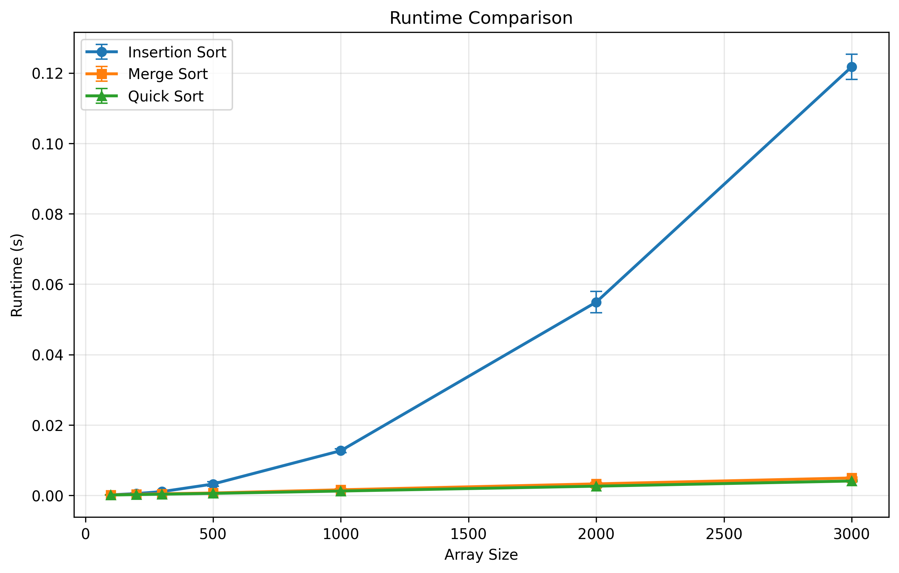
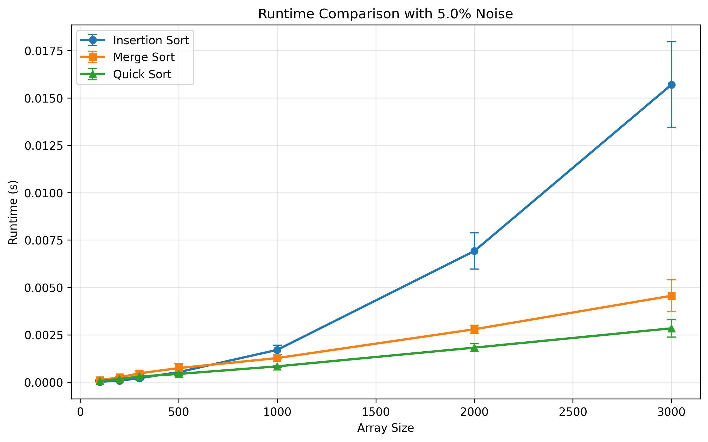

# Sorting Algorithms Performance Analysis

**Student Name:** Kfir Goldring

This project implements multiple sorting algorithms and benchmarks runtime behavior under different input conditions. The analysis in this README focuses on the selected algorithms:

- **Insertion Sort**
- **Merge Sort**
- **Quick Sort**

## Installation

Install required dependencies:
```bash
pip install -r requirements.txt
```

## Usage

Run experiments from the command line with the following syntax:
```bash
python run_experiments.py -a <algorithm_ids> -s <array_sizes> -e <experiment_type> -r <repetitions>
```

### Command-Line Arguments

- `-a, --algorithms`: Algorithm IDs to compare (space-separated)
  - `1` = Bubble Sort
  - `2` = Selection Sort
  - `3` = Insertion Sort
  - `4` = Merge Sort
  - `5` = Quick Sort
- `-s, --sizes`: Array sizes to test (space-separated integers)
- `-e, --experiment`: Experiment type
  - `0` = Random data (unsorted)
  - `1` = Nearly sorted with 5% noise
  - `2` = Nearly sorted with 20% noise
- `-r, --repetitions`: Number of repetitions for each test . results are averaged to reduce variability. 
This number has to be an integer!

###Running Examples  

Compare **Insertion, Merge, and Quick Sort** on random data:
```bash
python run_experiments.py -a 3 4 5 -s 100 500 3000 -e 0 -r 20 
##

```

Compare **Insertion, Merge, and Quick Sort** on nearly-sorted data:
```bash
python run_experiments.py -a 3 4 5 -s 100 500 1000 5000 -e 1 -r 10
python run_experiments.py -a 3 4 5 -s 100 500 1000 5000 -e 2 -r 10
```

## Output

The program generates:

- Console output with mean runtime ± standard deviation for each algorithm at each array size
- A plot saved as:
  - `result1.png` for experiment type `0`
  - `result2.png` for experiment types `1` and `2`

## Project Structure

```text
.
├── sorting_algorithms.py   # Implementation of all sorting algorithms
├── run_experiments.py      # Experiment runner with CLI interface
├── requirements.txt        # Python dependencies
└── README.md               # This file
```

## Experiments

### Comparative Experiment (Type 0)
Tests algorithms on randomly generated arrays.

### Noise Experiments (Types 1 and 2)
Tests algorithms on nearly-sorted arrays with controlled disorder:

- **5% noise**: Randomly swaps 5% of elements in a sorted array
- **20% noise**: Randomly swaps 20% of elements in a sorted array

## Experimental Results  

### Result 1: Comparative Experiment (Random Data)
Array sizes: 100, 200, 300, 500, 1000, 2000, 3000
Number of repetitions:20



**Measured Results (Random Data):**

| Array Size | Insertion Sort (s) | Merge Sort (s) | Quick Sort (s) |
|---|---:|---:|---:|
| 100  | 0.0001 ± 0.0000 | 0.0001 ± 0.0000 | 0.0001 ± 0.0000 |
| 200  | 0.0005 ± 0.0002 | 0.0003 ± 0.0001 | 0.0002 ± 0.0000 |
| 300  | 0.0011 ± 0.0001 | 0.0004 ± 0.0001 | 0.0003 ± 0.0000 |
| 500  | 0.0032 ± 0.0006 | 0.0007 ± 0.0000 | 0.0006 ± 0.0001 |
| 1000 | 0.0127 ± 0.0006 | 0.0016 ± 0.0003 | 0.0012 ± 0.0001 |
| 2000 | 0.0549 ± 0.0030 | 0.0033 ± 0.0005 | 0.0026 ± 0.0003 |
| 3000 | 0.1217 ± 0.0036 | 0.0049 ± 0.0002 | 0.0041 ± 0.0002 |

**Analysis  :**

- **Insertion Sort:** Runtime grows rapidly as input size increases, matching expected quadratic behavior on random data.
- **Merge Sort:/Quick Sort** Scale much better than insertion sort, matching lower theoretical runtime complexity  `O(n log n)`.
 


### Result 2: Nearly-Sorted Data Experiment
**5% Noise:**
Array sizes: 100, 200, 300, 500, 1000, 2000, 3000
Number of repetitions:20



**Measured Results (5% Noise):**

| Array Size | Insertion Sort (s) | Merge Sort (s) | Quick Sort (s) |
|---|---:|---:|---:|
| 100  | 0.0000 ± 0.0000 | 0.0001 ± 0.0000 | 0.0001 ± 0.0000 |
| 200  | 0.0001 ± 0.0000 | 0.0003 ± 0.0001 | 0.0002 ± 0.0000 |
| 300  | 0.0002 ± 0.0001 | 0.0005 ± 0.0001 | 0.0003 ± 0.0001 |
| 500  | 0.0005 ± 0.0002 | 0.0007 ± 0.0002 | 0.0004 ± 0.0001 |
| 1000 | 0.0017 ± 0.0002 | 0.0013 ± 0.0000 | 0.0008 ± 0.0000 |
| 2000 | 0.0069 ± 0.0010 | 0.0028 ± 0.0002 | 0.0018 ± 0.0002 |
| 3000 | 0.0157 ± 0.0023 | 0.0046 ± 0.0008 | 0.0028 ± 0.0005 |

**Analysis (Insertion, Merge, Quick):**
Comparing the results of the three algorithms,with the first experiment on random data we can see that:

- **Insertion Sort:** Improves significantly on nearly-sorted arrays because it is adaptive and approaches linear-like behavior when disorder is small, where for a sorted array(0 noise) it has linear time complexity `O(n)`.As array size increases,the disorder appears to make higher impact on the runtime which approaches `O(n^2)` behavior.
- **Merge Sort:** Performance remains stable, with limited sensitivity to initial ordering. Results on both experiments appear to coincide with one another within the margin of error.
- **Quick Sort:** Remains efficient, with a slight improvement on nearly-sorted arrays.

Near-sorted inputs reduce the practical gap between insertion sort and the `O(n log n)` algorithms at small sizes, but merge and quick sort still provide stronger scalability as size grows.

## Goals

- Compare practical runtime trends with theoretical complexity.
- Show when insertion sort is advantageous (nearly-sorted/smaller inputs) versus when merge and quick sort are preferable (larger inputs).
