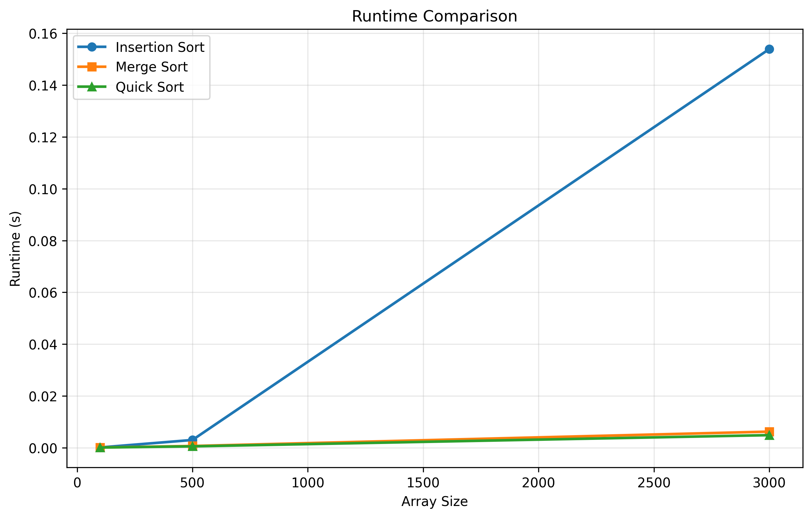

# Sorting Algorithms Performance Analysis

**Student Name:** Kfir Golring

This project implements and compares the performance of various sorting algorithms across different array sizes and data conditions.

## Selected Algorithms

1. **Bubble Sort** - O(n²) comparison-based algorithm
2. **Selection Sort** - O(n²) comparison-based algorithm
3. **Insertion Sort** - O(n²) comparison-based algorithm, efficient for nearly-sorted data
4. **Merge Sort** - O(n log n) divide-and-conquer algorithm
5. **Quick Sort** - O(n log n) average case divide-and-conquer algorithm

## Installation

Install required dependencies:
```bash
pip install -r requirements.txt
```

## Usage

Run experiments from the command line with the following syntax:
```bash
python run_experiments.py -a <algorithm_ids> -s <array_sizes> -e <experiment_type> -r <repetitions>
```

### Command-Line Arguments

- `-a, --algorithms`: Algorithm IDs to compare (space-separated)
  - `1` = Bubble Sort
  - `2` = Selection Sort
  - `3` = Insertion Sort
  - `4` = Merge Sort
  - `5` = Quick Sort

- `-s, --sizes`: Array sizes to test (space-separated integers)

- `-e, --experiment`: Experiment type
  - `0` = Experiment with random data (unsorted)
  - `1` = Nearly sorted with 5% noise
  - `2` = Nearly sorted with 20% noise

- `-r, --repetitions`: Number of repetitions for each test

### Examples

**Example 1**: Compare Insertion, Merge, and Quick Sort on arrays of sizes 100, 500, and 3000 with random data, 20 repetitions:
```bash
python run_experiments.py -a 3 4 5 -s 100 500 3000 -e 0 -r 20

Result:


In the figure we can see  that inseration sort is a lot slower than merge sort and quick sort , which appear to have similar running times. 
This coincides with the theoretical complexity of these algorithms- 0(n^2) for insertion sort, o (nlogn) for merge/quick sort. 
```

**Example 2**: Compare all algorithms on nearly-sorted data (5% noise):
```bash
python run_experiments.py -a 1 2 3 4 5 -s 100 500 1000 5000 -e 1 -r 10
```
 

## Output

The program generates:
- Console output showing mean runtime ± standard deviation for each algorithm at each array size
- A plot saved as:
  - `result1.png` for comparative experiments (experiment type 0)
  - `result2.png` for noise experiments (experiment types 1 and 2)

## Project Structure

```
.
├── sorting_algorithms.py   # Implementation of all sorting algorithms
├── run_experiments.py      # Experiment runner with CLI interface
├── requirements.txt        # Python dependencies
└── README.md              # This file
```

## Experiments

### Comparative Experiment (Type 0)
Tests algorithms on randomly generated arrays to measure performance on unsorted data.

### Noise Experiments (Types 1 and 2)
Tests algorithms on nearly-sorted arrays with controlled amounts of disorder:
- **5% noise**: Randomly swaps 5% of elements in a sorted array
- **20% noise**: Randomly swaps 20% of elements in a sorted array

---

## Experimental Results

### Result 1: Comparative Experiment (Random Data)


**Explanation:**

This experiment compares the performance of all five sorting algorithms on randomly generated arrays of varying sizes. The results clearly demonstrate the difference between O(n²) and O(n log n) algorithms:

- **O(n²) algorithms (Bubble, Selection, Insertion):** Show quadratic growth in runtime as array size increases. These algorithms become impractical for large datasets (>10,000 elements), with execution times growing rapidly.

- **O(n log n) algorithms (Merge, Quick):** Display significantly better scalability, maintaining reasonable performance even on large arrays. These algorithms show the characteristic logarithmic growth pattern, making them suitable for production use.

- **Key Observation:** The performance gap between O(n²) and O(n log n) algorithms widens dramatically as array size increases, validating theoretical complexity analysis.

---

### Result 2: Nearly-Sorted Data Experiment


**Explanation:**

This experiment tests algorithm performance on nearly-sorted arrays with controlled noise levels (5% or 20% random swaps).

**How Running Times Changed:**

- **Insertion Sort:** Shows **significant improvement** on nearly-sorted data compared to random data. This is because insertion sort's best-case performance is O(n) when data is already sorted or nearly sorted. Each element requires minimal comparisons and shifts.

- **Bubble Sort:** Also shows **moderate improvement** on nearly-sorted data, though less dramatic than insertion sort. The early termination optimization (when no swaps occur) helps reduce unnecessary passes.

- **Selection Sort:** Shows **minimal to no improvement** on nearly-sorted data. This algorithm always performs O(n²) comparisons regardless of initial order, as it must scan the entire unsorted portion to find the minimum element.

- **Merge Sort & Quick Sort:** Show **relatively consistent performance** across both random and nearly-sorted data. These divide-and-conquer algorithms don't benefit significantly from initial ordering, maintaining their O(n log n) complexity.

**Why These Changes Occur:**

The key difference lies in how algorithms exploit existing order:
- **Adaptive algorithms** (Insertion, Bubble) can skip unnecessary operations when data is partially sorted
- **Non-adaptive algorithms** (Selection) perform the same operations regardless of input order
- **Divide-and-conquer algorithms** (Merge, Quick) partition data systematically without considering initial order

This demonstrates why insertion sort is often preferred for small or nearly-sorted datasets despite its O(n²) worst-case complexity.

---

## Goals

Illustrate the difference in growth rate between slower and faster algorithms, and compare runtime with theoretical complexity expectations.
